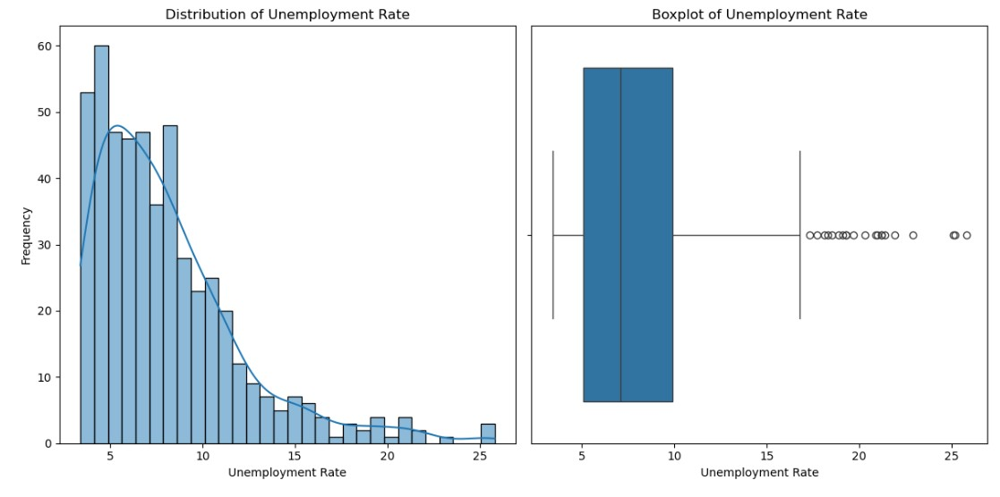
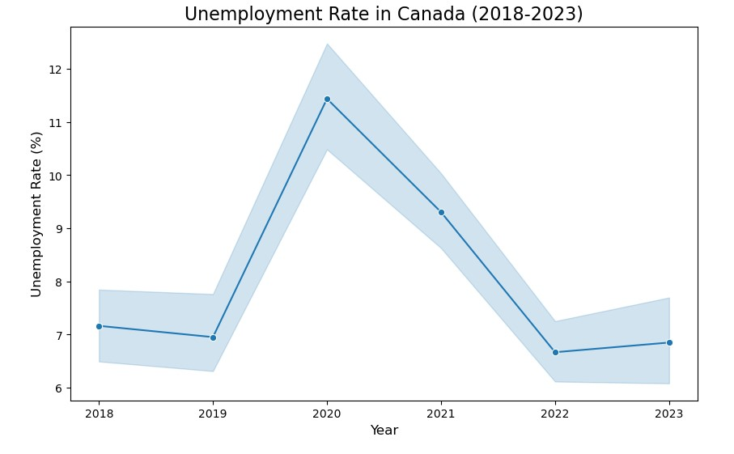
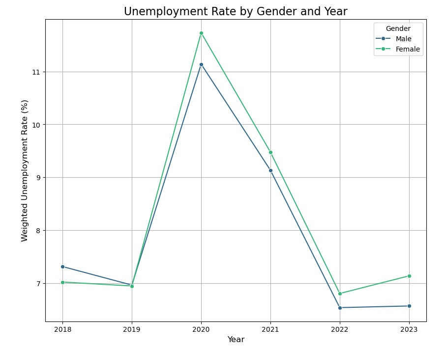
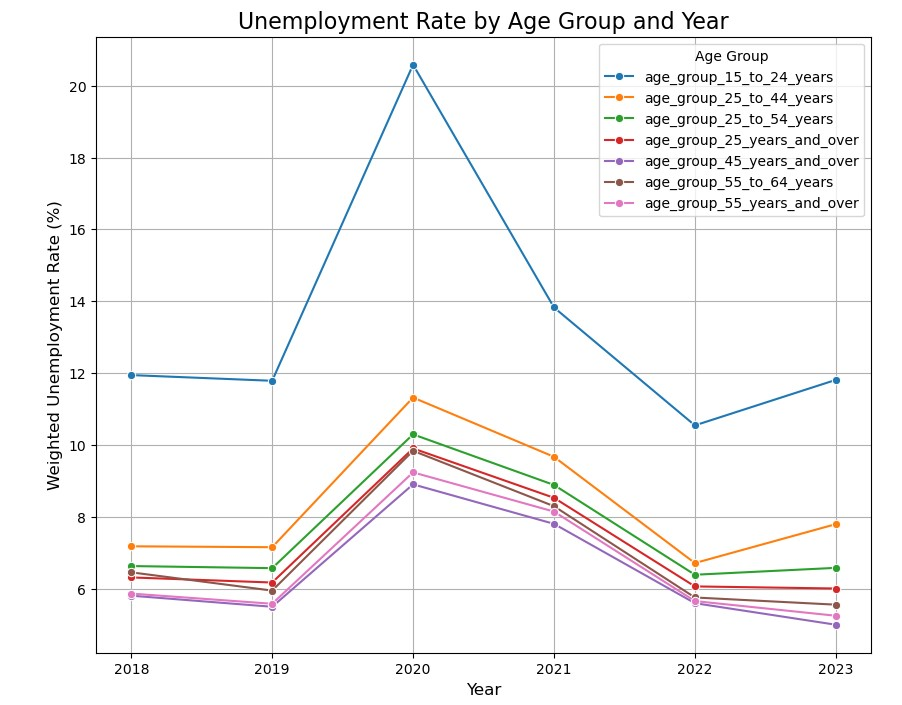
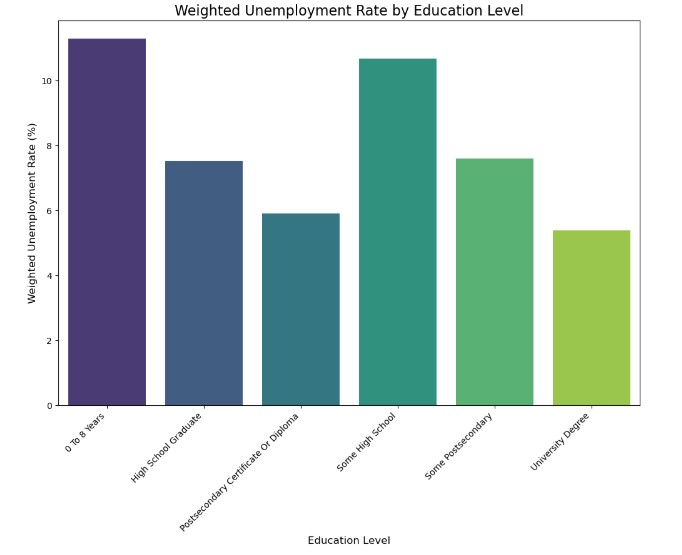
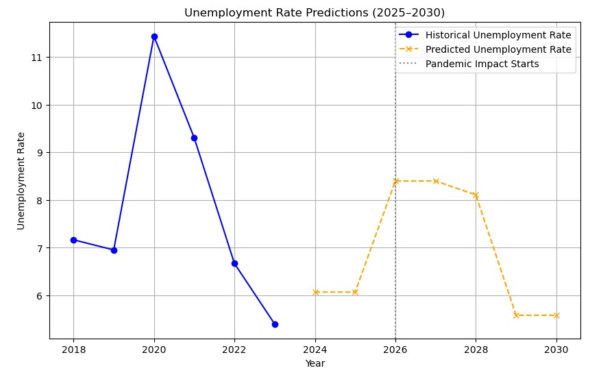

# 🇨🇦 Canadian Unemployment Forecasting (2018–2030)
Forecasting Canadian unemployment trends using machine learning (Random Forest, Ridge, KNN, etc.) with insights on pandemic impact, gender, age, and education.


## 📘 Overview
This project examines unemployment data in Canada over the past six years (2018–2023), focusing on the significant impact of the global Covid-19 pandemic on unemployment rates during 2020–2021. The analysis utilizes publicly available data from the Statics Canada, ensuring accuracy and transparency in the study. The aim is to gain a deeper understanding of the pandemic's effects on various demographic groups and to provide insights that can inform future policy development. In addition to analyzing the pandemic's impact, unemployment rates have been studied across different education levels, gender groups, and age ranges to identify which groups were most affected. Furthermore, the project attempts to predict the potential impact of a similar crisis, such as a pandemic, on unemployment rates over the next six years (2025–2030). Using machine learning models, historical data was analyzed to make these forecasts. The goal of this project is to highlight how crises impact unemployment rates across different demographics, helping the Canadian government develop proactive policies to mitigate the effects of such events in the future.

The updated unemployment rate predictions for Canada provide crucial insights into future labor market trends, highlighting an increase in unemployment in 2024 due to inflationary pressures, sectoral adjustments, and slow employment recovery (Gellatly & McCormack, 2024). The projections also emphasize the potential impact of a prolonged pandemic from 2026 to 2028, with unemployment peaking at 8% in 2027, reflecting a sustained economic downturn with slower recovery compared to the sharp yet short-lived spike during the 2020 pandemic. This underscores the importance of long-term policy interventions to mitigate disruptions. Key factors driving these predictions, such as gender and aging demographics, align with established labor market dynamics. The model's behavior and outputs are consistent with domain expertise, accurately identifying vulnerable sectors like healthcare, retail, and manufacturing, which are expected to face significant strain during future crises. The integration of parameters such as pandemic impact, demographic changes, and sector-specific vulnerabilities ensures the model is contextually relevant and robust. The model avoids drastic overestimations or underestimations, as it provides a reasonable unemployment projection of 8% during prolonged crises. Such results align with historical data, indicating the model avoids intolerable errors. However, while the Random Forest model performs well for non-linear relationships, testing alternative models (e.g., Gradient Boosting or Neural Networks) could confirm whether they yield better performance or complementary insights.

While the model demonstrates validity and provides actionable insights for planning, incorporating additional data—such as regional economic variations or global economic trends—could further enhance its accuracy. Overall, the predictions highlight the structural vulnerabilities and opportunities in Canada’s workforce, emphasizing the need for proactive, targeted policies to enhance labor market resilience and address demographic challenges.

The gender dimension remains a critical factor in these predictions. During the 2020 pandemic, women experienced disproportionate job losses due to their overrepresentation in vulnerable sectors such as retail, hospitality, and caregiving services (Grekou & Lu, 2021). This trend is expected to repeat during the simulated 2026–2028 pandemic unless specific policies are implemented to mitigate these disparities.

The aging population adds another layer of complexity to these projections. According to Global News’s report (2024), “Canada’s 85-and-over population set to triple over next 40 years”. With older workers comprising an increasing proportion of the workforce, demographic shifts are expected to lead to a contraction in the labor pool as retirement rates rise. Older workers may also face heightened risks of unemployment during crises due to potential skill mismatches and health vulnerabilities. The growing dependency ratio associated with an aging population will place additional strain on social security systems, necessitating higher productivity from a shrinking active workforce. To counteract this, policies encouraging increased female workforce participation and supporting the retention of older workers will be essential (Vézina and others, 2024). To address these challenges, Canada should adopt policies targeting structural vulnerabilities and fostering labor market resilience. Gender-sensitive measures like childcare subsidies and support for female-dominated sectors are crucial, alongside financial incentives for manufacturing and services. Workforce development through reskilling, upskilling, and targeted hiring subsidies for youth and women is essential. Flexible work options, including hybrid and remote arrangements, can further support workforce participation and caregiving responsibilities.
Finally, economic stimulus measures are essential for stabilizing unemployment in 2024 and addressing potential disruptions in 2026–2028. Priority should be given to supporting industries like retail, tourism, and hospitality, fostering innovation- driven entrepreneurship, and providing temporary wage subsidies to protect vulnerable groups. Targeted, long-term interventions addressing gender disparities, demographic shifts, and sector vulnerabilities will enhance labor market resilience and ensure sustainable economic growth.

---

## 🔍 Key Features

- 📊 Yearly analysis of unemployment distribution
- 🧠 Trained ML models: Random Forest, Ridge, Lasso, KNN, Decision Tree, Linear Regression
- 🦠 Scenario-based testing: pandemic, youth surge, education gap
- 🔬 Synthetic forecasting with a generated future dataset
- 📁 Organized Jupyter and Python modules (`Codes.ipynb`, `Modules/`)

---
## 🗂️ Repository Structure
<pre> ``` 📁 canadian-unemployment-analysis-ml/ │ ├── 📁 Images/ # Data visualizations │ ├── distribution_boxplot.jpg │ ├── forecast_2025_2030.jpg │ ├── gender_impact.jpg │ ├── unemployment_rate_by_age_group.jpg │ ├── unemployment_rate_by_education_level.jpg │ ├── yearly_unemployment_trend.jpg │ ├── employment.png, e2.png, e3.png, e4.png │ ├── 📁 dataset/ # Cleaned & synthetic datasets │ ├── unemployment.csv │ ├── clean_unemployment.csv │ ├── predicted_unemployment_dataset.csv │ ├── projections.csv │ ├── unemployment_MetaData.csv │ └── Guide for Datasets.docx │ ├── 📁 Modules/ │ └── pipeline_regression.py # Model pipeline and tuning ├── Codes.ipynb # Jupyter Notebook with full analysis ├── Machine Learning Insights into Canadian Unemployment.pdf └── README.md ``` </pre>

---
## 🖼️ Visualizations

| 📊 Plot | 📄 Description |
|--------|----------------|
|  | Distribution of unemployment rates |
|  | Yearly trend (2018–2023) |
|  | Gender-wise unemployment |
|  | Age-wise impact |
|  | Education level comparison |
|  | Forecast from 2025–2030 |

---

## 🤖 ML Model Comparison

| Model             | R² Score | MSE   |
|------------------|----------|-------|
| **Random Forest** | **0.92** | **1.53** |
| Decision Tree     | 0.89     | 2.00  |
| Ridge Regression  | 0.84     | 2.91  |
| Linear Regression | 0.85     | 2.80  |
| KNN               | 0.70     | 5.50  |
| Lasso Regression  | 0.43     | 10.33 |

✅ **Best Model**: Random Forest Regressor (Tuned using GridSearchCV)

---

## 👩‍💻 Author

**Ayşegül Dahi**   
📍 Vancouver, BC  
🔗 [LinkedIn](https://linkedin.com/in/ayseguldahi)

---

## 🚀 Future Enhancements

- Regional breakdown by province or territory  
- Inclusion of economic indicators (CPI, GDP)  
- Interactive dashboard with Streamlit or Tableau  
- Application of ensemble methods like XGBoost

---

> ⭐ *If this project was helpful, give it a star or fork it to explore more!*


